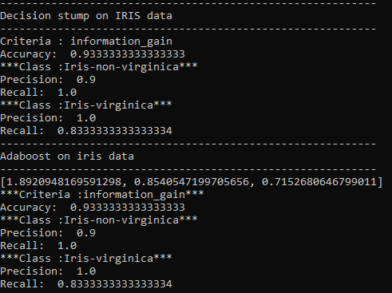

# ES654-2020 Assignment 2

Onteddu Rama Krishna Reddy - 17110094

> Write the answers for the subjective questions here

The results of IRIS data with 60% train and 40% split data on respective classifiers.

The printed list contains the values of alpha in each iteration.

The results obtained are same in the case of decision stump and combination of adaboost trees because the weight associated (alpha) with the prediction of first tree is maximum and greater than the sum of other two.

The decision surfaces learnt by individual estimators are shown below, with size based on weights.

The decision surface learnt by the combination of all the estimators is shown below.

