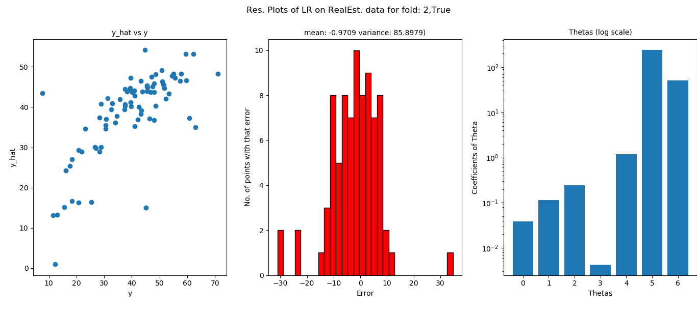

# ES654-2020 Assignment 2

Onteddu Rama Krishna Reddy - 17110094

---------
---
Random Data
------
-------
RMSE and MAE
---

Comparision of time complexity (Observed vs Estimated )
--

Residual plots 
---
    (a) fit_intercept = True

    (b) fit_intercept = False

------
-----
Real Estate dataset
------
    (a) fit_intercept = True

    (b) fit_intercept = False

Residual Plots
---
    (a) Fit_intercept = True

- fold 1

- fold 2

- fold 3

- fold 4

- fold 5

    (b) Fit_intercept = False

- fold 1

- fold 2

- fold 3

- fold 4

- fold 5

