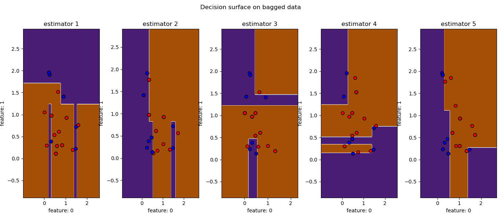
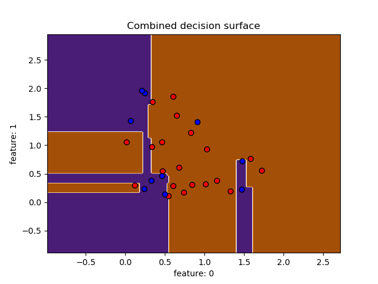
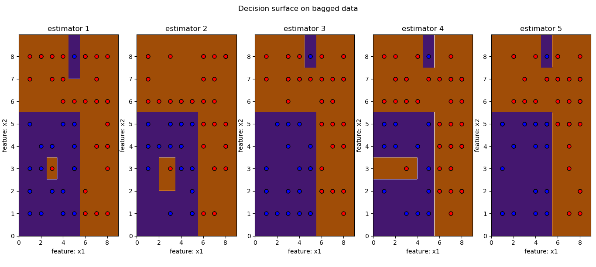
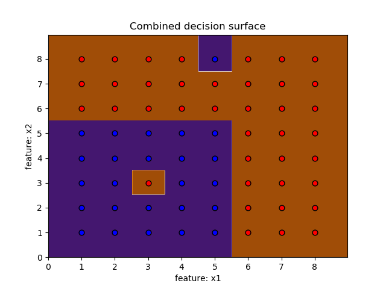
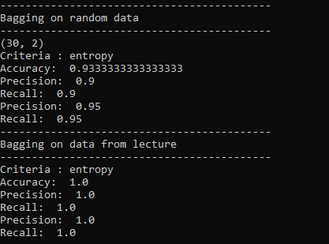

# ES654-2020 Assignment 2

Onteddu Rama Krishna Reddy - 17110094

------
------
Bagging on Random Data
--

    Individual Estimators 

    Combination of Estimators

---
---
Bagging on Data from Lecture
---
    Individual Estimators

    Combination of Estimators

---
---
Results on random data and lecture from data
---
